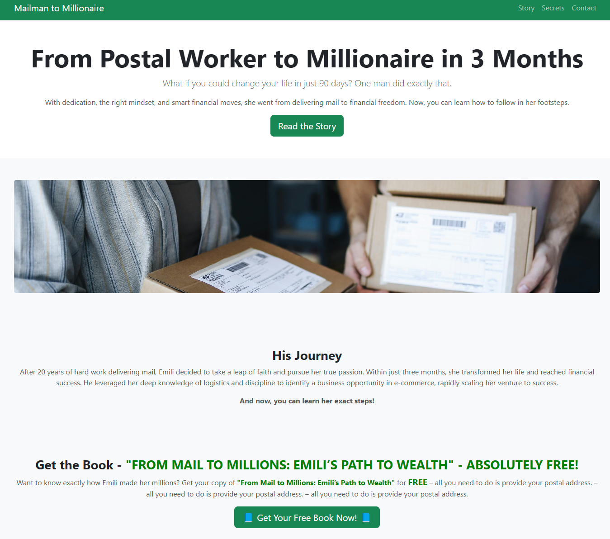

# 📬 From Mailman to Millionaire 🚀



## 🌟 О проекте
"From Mailman to Millionaire" — это лендинг, рассказывающий историю о том, как почтальон смог стать миллионером всего за 3 месяца. Сайт предлагает пользователям заказать **бесплатную книгу** с секретами успеха.

## 🔥 **Технологии**
- HTML5 + CSS3
- Bootstrap 5
- JavaScript (AJAX, Fetch API)
- PHP (сервер на Render)
- PHPMailer (отправка email через SMTP)

## 🚀 **Деплой**
Сайт размещён на **Render**.
Нужно для работы PHPMailer
➡ **[Перейти на сайт](http://landing-postman.onrender.com/)**
Так же в сайте прописана работа с сервером рендер через GitHub pages
Сайт размещён на **GitHub pages**.
➡ **[Перейти на сайт](https://zloygolub.github.io/landing-postman/)**

## 📥 **Установка и запуск (локально)**
### 1️⃣ **Клонируем репозиторий**
```bash
git clone https://github.com/ZloyGolub/landing-postman.git
cd landing-postman

2️⃣ Устанавливаем зависимости
Убедись, что у тебя установлен Composer

composer install

3️⃣ Настраиваем переменные окружения
Создай файл .env и добавь:

EMAIL_USER=your-email@gmail.com
EMAIL_PASS=your-app-password

💡 Как помочь проекту?
Если у тебя есть идеи, создай Issue или Pull Request.
Любой вклад приветствуется! 🙌

💬 Связь:       
Telegram: **[ZloyGolub](https://t.me/zloygolub)**
Email: **[ZloyGolub](mailto:zloygolub@gmail.com)**
📌 Автор: **[ZloyGolub](mailto:zloygolub@gmail.com)**
🚀 Лицензия: MIT
